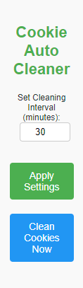

# Cookie Auto Cleaner

**Cookie Auto Cleaner** is a powerful Chrome extension designed to automatically clean cookies at user-defined intervals, ensuring enhanced privacy and optimal browser performance. With a sleek, modern interface and user-friendly controls, Cookie Auto Cleaner provides a seamless experience for managing your browser cookies effortlessly.

## Key Features

- **Automated Cookie Cleaning**: Set intervals to automatically clean cookies in the background, keeping your browsing session private and clutter-free.
- **Manual Cookie Cleaning**: Instantly remove all cookies with a single click for those moments when you need immediate action.
- **Customizable Time Intervals**: Choose your preferred interval (from 1 to 1440 minutes) for automated cleaning.
- **Modern, Intuitive UI**: A clean, responsive interface with simple controls that make managing your settings easy.
- **Low Resource Usage**: Optimized for performance with minimal impact on your browser’s speed and memory.

## Getting Started

### Installation

#### Install from Chrome Web Store

You can easily install the extension directly from the [Chrome Web Store](https://chromewebstore.google.com/detail/cookie-auto-cleaner/khpljehnodkphaclkdggonfbjalodplg?authuser=0).

#### Manual Installation Using CRX File

1. Download the latest release CRX file from the [Project page](https://github.com/firatkaanbitmez/cookie-auto-cleaner-extension/releases).
2. Open Chrome and navigate to `chrome://extensions/`.
3. Enable "Developer mode" by toggling the switch in the top right corner.
4. Drag and drop the downloaded `.crx` file into the `chrome://extensions/` page to install the extension.

#### Install Using Source Code

1. Download the latest release from the [Project page](https://github.com/firatkaanbitmez/cookie-auto-cleaner-extension).
2. Extract the downloaded ZIP file.
3. Open Chrome and navigate to `chrome://extensions/`.
4. Enable "Developer mode" by toggling the switch in the top right corner.
5. Click on "Load unpacked" and select the `src` folder from the extracted files.

## How to Use

- **Set Cleaning Interval**: Open the extension and choose how often (in minutes) you want cookies to be cleaned automatically.
- **Apply Your Settings**: Click the "Apply Settings" button to save your preferences.
- **Manually Clean Cookies**: Click the "Clean Cookies Now" button to instantly remove all cookies.
- **Monitor Your Status**: The status message will update to confirm when cookies are successfully cleaned.

## Screenshots

## Error Solutions for Chrome and Edge

If you encounter the following error during installation:

**EN**: "This extension is not from any known source, and may have been added without your knowledge."

**TR**: "Bu uzantı, bilinen herhangi bir kaynaktan değil ve bilginiz dışında eklenmiş olabilir."

Follow these steps to resolve the issue:

1. Run the `fix.bat` file located in the project folder as an administrator. This will adjust the necessary Windows Registry settings to support the installation of the extension.
2. The browsers will be restarted automatically upon completion.

## Development

To build and test the extension locally:

1. Navigate to the `src` folder in your terminal.
2. Use the `fix.bat` script to register the extension and restart browsers.

## Configurable Options

Customize your experience on the options page with settings like:
- **Cleaning Interval**: Set the default cleaning interval according to your needs.
- **Shortcut Preferences**: Customize keyboard shortcuts for quicker access.

## Contributing

We welcome contributions! If you have ideas or improvements, please fork the project, implement your changes, and submit a pull request.

## Development Tools

Built with:
- **HTML/CSS** for the interface design.
- **JavaScript** for background logic and interaction handling.
- Chrome's **alarms**, **cookies**, and **storage** APIs for efficient performance and control.

## Feedback and Support

Got feedback or need help? Reach out via [email](mailto:firatbitmez.dev@gmail.com).

## License

**Cookie Auto Cleaner** is made available under the MIT License. See the [LICENSE.md](LICENSE.md) file for full details.
